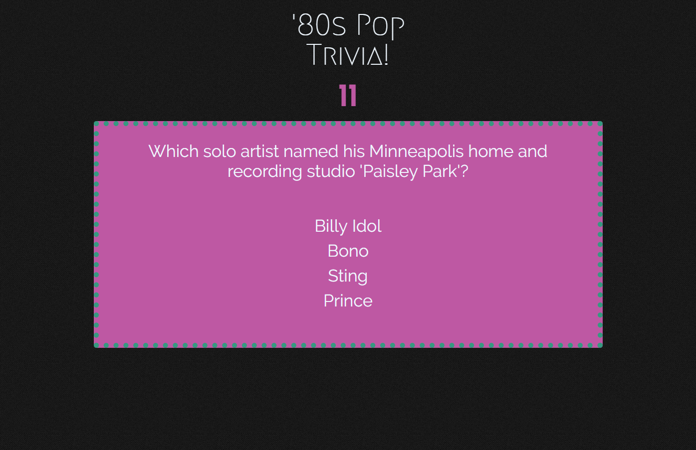
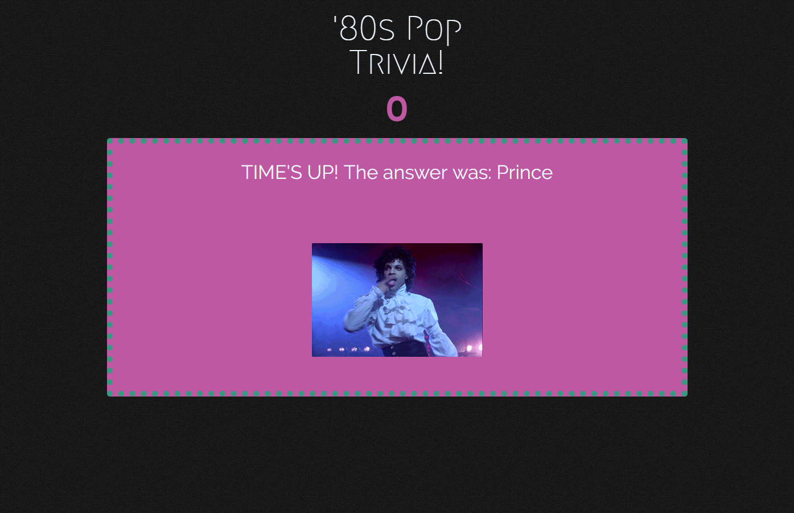
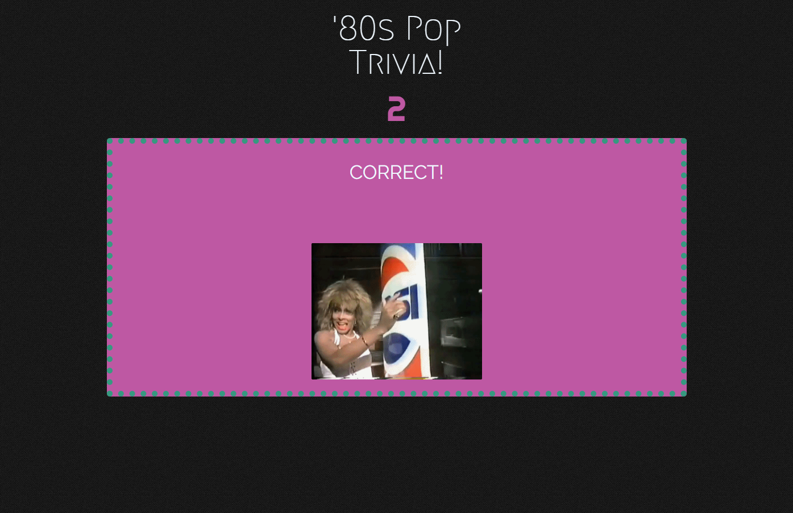
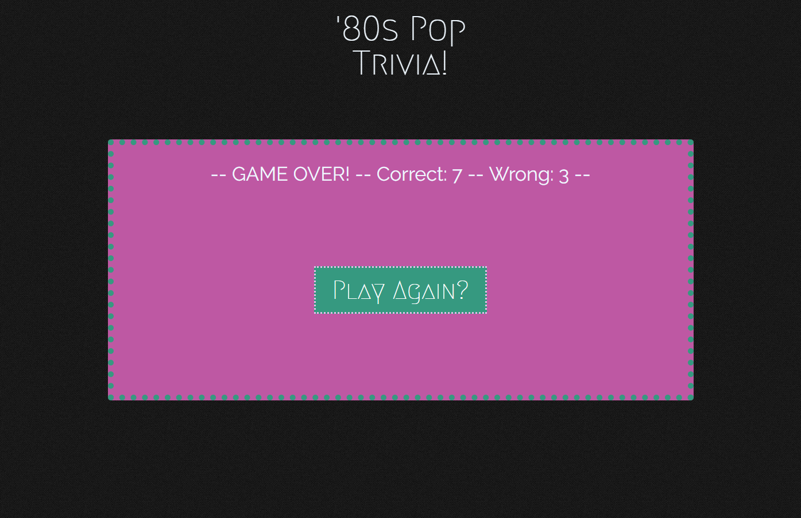

# 1980s Pop Trivia
## UNC Coding Bootcamp JavaScript Homework #5  10-9-2018

This game is a multiple choice trivia challenge with a timer for each question.

This app uses:
* Javascript and jQuery for game logic and interactivity
* HTML and CSS for layout and styling

My deployed app can be viewed here: https://zinc-glaze.github.io/TriviaGame/

### Screenshots

The assigment specified the following requirements:

* You'll create a trivia game that shows only one question until the player answers it or their time runs out.

* If the player selects the correct answer, show a screen congratulating them for choosing the right option. After a few seconds, display the next question -- do this without user input.

* The scenario is similar for wrong answers and time-outs.

  * If the player runs out of time, tell the player that time's up and display the correct answer. Wait a few seconds, then show the next question.
  * If the player chooses the wrong answer, tell the player they selected the wrong option and then display the correct answer. Wait a few seconds, then show the next question.

* On the final screen, show the number of correct answers, incorrect answers, and an option to restart the game (without reloading the page).

This app fulfills those requirements and also adds a "shuffle questions" function, and an image on the win/lose/timeup screen.
